

# Overview

The workshop aims to explore the use of synthetic data in training and evaluating computer vision models, as well as in other related domains. During the last decade, advancements in computer vision were catalyzed by the release of painstakingly curated human-labeled datasets. Recently, people have increasingly resorted to synthetic data as an alternative to laborintensive human-labeled datasets for its scalability, customizability, and costeffectiveness. Synthetic data offers the potential to generate large volumes of diverse and high-quality vision data, tailored to specific scenarios and edge cases that are hard to capture in real-world data. However, challenges such as the domain gap between synthetic and real-world data, potential biases in synthetic generation, and ensuring the generalizability of models trained on synthetic data remain. We hope the workshop can provide a forum to discuss and encourage further exploration in these areas.

# Invited Speakers 
* The speakers haven't been finalized, stay tuned for updates!

  

     
  <a href="https://anikem.github.io/">Ani	Kembhavi</a> 
    Allen Institute for AI (AI2)
  

  

     
  <a href="https://people.csail.mit.edu/ludwigs/">Ludwig Schmidt</a> 
    University of Washington
  

  
   

     
  <a href="https://www.cs.umd.edu/people/lin">Ming Lin</a> 
    University of Maryland
  

  
  

     
  <a href="https://www.cs.princeton.edu/~olgarus/">Olga Russakovsky</a> 
    Princeton University
  

  

     
    <a href="https://people.csail.mit.edu/yalesong/home/">Yale Song</a> 
    FAIR, Meta AI
  

  

    <a href="https://www.skamalas.com/">
      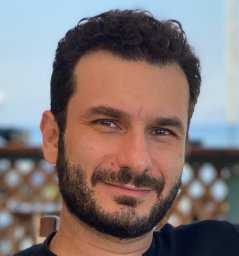
    </a> 
    <a href="https://www.skamalas.com/">Yannis Kalantidis</a> 
    NAVER LABS Europe
  

   

  

   
   
  

# Schedule
<!-- <table>
  <tr><td>Times (PST)</td><td> </td></tr>
  <tr><td>13:00</td><td>Opening Remarks</td></tr>
  <tr><td>13:10-13:40</td><td>Rainer Stiefelhagen</td></tr>
  <tr><td>13:40-14:10</td><td>Jennifer Mankoff</td></tr>
  <tr><td>14:10-14:20</td><td>Challenge Winner Announcements</td></tr>
  <tr><td>14:20-14:40</td><td>Challenge Winner Talks</td></tr>
  <tr><td>14:40-15:00</td><td>Poster Highlights</td></tr>
  <tr><td>15:05-15:45</td><td>Hybrid Poster Session (first 20 minutes) + Coffee Break (last 20 minutes)</td></tr>
  <tr><td>15:45-16:15</td><td>Smit Patel</td></tr>
  <tr><td>16:15-16:45</td><td>Richard Ladner, "Including Accessibility and Disability in an Undergraduate CV Course"</td></tr>
  <tr><td>16:45-17:30</td><td>Concluding Remarks, Poster Session #2</td></tr>
</table> -->
- TBD
  
# Accepted Papers

<!-- <table>
  <tr><td><a href="https://drive.google.com/file/d/1T6tTbxGM2OgYzb1anZhHlQ3mrPpRFKqR/view?usp=sharing">"Cascaded Training Strategy for CVPR2023 Synthetic Instance Segmentation"</a>. Runze Zhang, Xiaochuan Li, Baoyu Fan, Zhenhua Guo, Yaqian Zhao, Rengang Li</td></tr>
  <tr><td><a href="https://drive.google.com/file/d/14ShWx1XljemvIpIDI6341s2MpTMNsd_X/view?usp=sharing">"Non-Hierarchical Transformers for Pedestrian Segmentation"</a>. Amani Kiruga, Xi Peng</td></tr>
  <tr><td><a href="https://drive.google.com/file/d/1okBN8qofg6i-5iu22PzBrxECBBUX661B/view?usp=sharing">"MultiHead Attention Mask-RCNN for AVA Instance Segmentation"</a>. Aarti Balana</td></tr>
  <tr><td><a href="https://drive.google.com/file/d/1B9bricf2dPqI35_qk_mhqZ3qPDNqdpCv/view?usp=sharing">"The First Place Solution for CVPR 2023 AVA Challenge - Keypoint Track"</a>. Chenglong Yi, Fuxing Leng</td></tr>
  <tr><td><a href="https://drive.google.com/file/d/1s8K3HF803geK9lotHYSjPqZXIHg8MRod/view?usp=sharing">"An Improved Baseline for Keypoint Track in CVPR2023 AVA Accessibility Vision and Autonomy Challenge"</a>. Jiajun Fu, Shaojie Zhang, Jianqin Yin</td></tr>
  <tr><td><a href="https://drive.google.com/file/d/1EBZb95ZcRye2sXro2xwsRphplaH9F6bm/view?usp=sharing">"A dataset of human actions for abnormal event recognition in assistive robotic environments"</a>. Catherine Huyghe, Nacim Ihaddadene</td></tr>
  <tr><td><a href="https://drive.google.com/file/d/1RTAlWiD1eOru5IyTp_ojBIwlngoJv1oZ/view?usp=sharing">"Textual and Directional Sign Recognition Algorithm for People with Visual Impairment by Linking Texts and Arrows"</a>. Masaki Kuribayashi, Hironobu Takagi, Chieko Asakawa, Shigeo Morishima</td></tr>
  <tr><td><a href="https://drive.google.com/file/d/1i7oUOQyJHXhya4BpC0bMdnaHK_IX7qkf/view?usp=sharing">"Case Study of GAI for Accessible Design and Prototyping"</a>. Kate Glazko, Jennifer Mankoff</td></tr>
  <tr><td><a href="https://drive.google.com/file/d/1wwSus3hkZCnRw-YJARgaOLNdKHaYaR5m/view?usp=sharing">"Shared Affordance-awareness via Augmented Reality for Proactive Assistance in Human-robot Collaboration"</a>. Drake Moore</td></tr>
  <tr><td><a href="https://drive.google.com/file/d/122wAn_IdZL5KoyjkCsBg7IxtOLIGz7jR/view?usp=sharing">"Slovo: Russian Sign Language Dataset"</a>. Alexander Kapitanov</td></tr>
  <tr><td><a href="https://drive.google.com/file/d/1t_BpByMpW5PnLHCI4LtmXXdwq-u19g-x/view?usp=sharing">"X-World: Accessibility, Vision, and Autonomy Meet"</a>, Jimuyang Zhang*, Minglan Zheng*, Matthew Boyd, Eshed Ohn-Bar</td></tr>
  <tr><td><a href="https://drive.google.com/file/d/1eCd7wQrKpItxhDEUIjrJkmgtFAS5VZrB/view?usp=sharing">"ASSISTER: Assistive Navigation via Conditional Instruction Generation"</a>. Zanming Huang*, Zhongkai Shangguan*, Jimuyang Zhang, Gilad Bar, Matthew Boyd, and Eshed Ohn-Bar</td></tr>
</table> -->
- TBD

<!-- 

  

     
    <a href="https://eshed1.github.io/">Eshed Ohn-Bar</a> 
    Boston University
  

  
  

  

   
  

     
  <a href="https://home.cs.colorado.edu/~DrG/AboutMe.html">Danna Gurari</a> 
    University of Colorado Boulder
  

  
    

  

       
  

     
  <a href="https://researcher.watson.ibm.com/researcher/view.php?person=us-chiekoa">Chieko Asakawa</a> 
    Carnegie Mellon University and IBM
  

  
    

  

  

    <a href="https://ischool.umd.edu/directory/hernisa-kacorri/">
    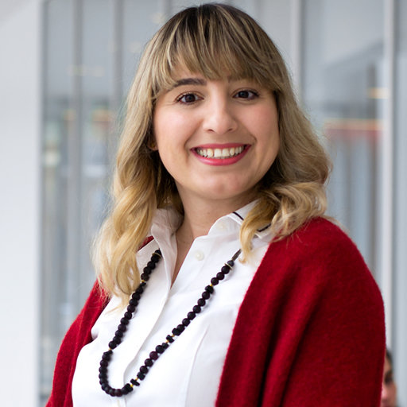
    </a> 
  <a href="https://ischool.umd.edu/directory/hernisa-kacorri/">Hernisa Kacorri</a> 
    University of Maryland
  

  
    

  

  
    

     
  <a href="http://www.cs.cmu.edu/~kkitani/">Kris Kitani</a> 
    Carnegie Mellon University
  

 -->

  

<!-- ## Advising committee -->

<!-- 

 

     
  <a href="https://staging-temp-site.github.io/staging-temp-site.gitub.io/">[Name]</a> 
    [Institution]
  

  
  

  

   
  

     
  <a href="https://staging-temp-site.github.io/staging-temp-site.gitub.io/">[Name]</a> 
    [Institution]
  

 -->

<!-- ## Program Committee -->
<!-- 
| --- | --- |
|  |  | -->

<!-- ## Student Organizers -->
<!-- 
| --- | --- |
|  |  |
 -->

<!-- ## Call for papers -->
<!-- Please refer to the **[call for papers](./call-for-papers.html)** page for more details. -->

<!-- 

<u><g8>Challenge</g8></u>

 -->

<!-- ## Challenge overview -->
<!-- 

Towards building a community of accessibility research in computer vision conferences, we introduce a computer vision challenge with synthetic and real-world benchmarks. The challenge (based on our ICCV’21 paper, <a href="https://openaccess.thecvf.com/content/ICCV2021/papers/Zhang_X-World_Accessibility_Vision_and_Autonomy_Meet_ICCV_2021_paper.pdf">bit.ly/2X8sYoX</a>) will be used to benchmark various computer vision tasks when comparing new and established methods for fine-grained perception of tasks relevant to people with disabilities. The challenge is designed in the spirit of various other vision challenges that help advance the state-of-the-art of computer vision for autonomous systems, e.g., in robust vision (CVPR’21), human action recognition trajectory forecasting (CVPR’21), etc. E
 

    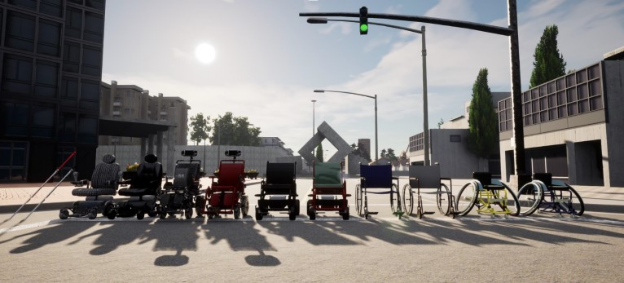
    
Fig. 1: An interactive simulation environment will be used as part of the workshop challenge for training machine perception and learning models in the context of accessibility (taken from <a href="https://openaccess.thecvf.com/content/ICCV2021/papers/Zhang_X-World_Accessibility_Vision_and_Autonomy_Meet_ICCV_2021_paper.pdf">bit.ly/2X8sYoX</a>).

  

    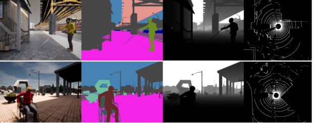
    
An example from the instance segmentation challenge for perceiving people with mobility aids.

  

 -->

<!-- ## Challenge Organization

  

    <a href="mailto:sgzk@bu.edu">
    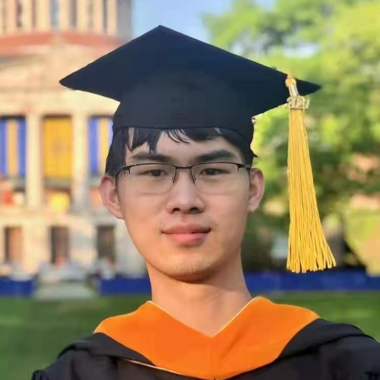
    </a> 
  <a href="mailto:sgzk@bu.edu">Zhongkai Shangguan</a> 
    Boston University
  

  
    

  

  
  

    <a href="mailto:zhangjim@bu.edu">
    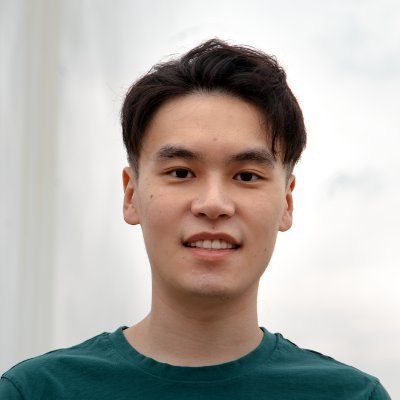
    </a> 
    <a href="mailto:zhangjim@bu.edu">Jimuyang Zhang</a> 
    Boston University
  

 -->

  

<!-- ## Challenge

  
  <strong>As an updated challenge for 2023, we release the following:</strong>
  
  <ol>
  <li>Training, validation, and testing data, which can be found in <a href="https://drive.google.com/drive/folders/12e-Qom2qQWF7brBu36sIQZWfj8kTBtj-?usp=share_link">this link</a></li>
    <li>An evaluation server <a href="https://eval.ai/web/challenges/challenge-page/1998/overview">for instance segmentation</a> and <a href="https://eval.ai/web/challenges/challenge-page/2001/overview">for pose estimation.</a></li>
  </ol>
  
  More info on data and submission can be found in the eval.ai links above. Note that the data this year includes both instance segmentation and pose estimation challenge. Moreover, we provide access to temporal history and LiDAR data for each image.
  
   
  The challenge builds on our prior workshop's synthetic instance segmentation benchmark with mobility aids (see Zhang et al., X-World: Accessibility, Vision, and Autonomy Meet, ICCV 2021 <a href="https://openaccess.thecvf.com/content/ICCV2021/papers/Zhang_X-World_Accessibility_Vision_and_Autonomy_Meet_ICCV_2021_paper.pdf">bit.ly/2X8sYoX</a>). The benchmark contains challenging accessibility-related person and object categories, such as `cane' and `wheelchair.' We aim to use the challenge to uncover research opportunities and spark the interest of computer vision and AI researchers working on more robust visual reasoning models for accessibility. 
  

    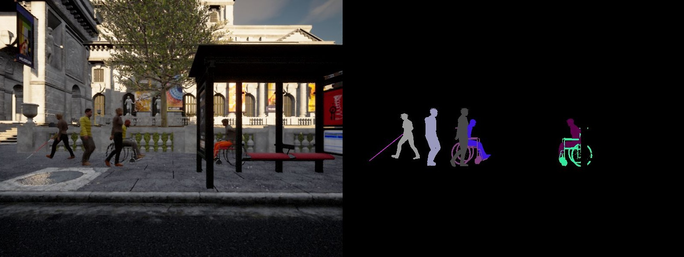
    
An example from the instance segmentation challenge for perceiving people with mobility aids.

  

    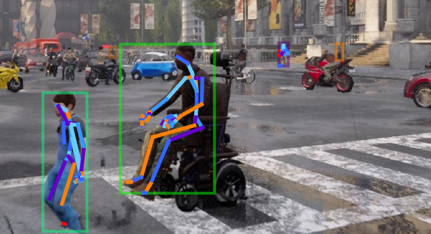
    
An example from the pose challenge added in 2023.

   
  The team with the top performing submission will be invited to give short talks during the workshop and will receive a financial award of <b>$500</b> and an <a href="https://store.opencv.ai/products/oak-d">OAK—D camera</a> (We thank the National Science Foundation, US Department of Transportation's Inclusive Design Challenge and Intel for their support for these awards) 
    

 -->

 
  
  
  
# Call for Papers

<!-- 

We encourage submission of relevant research (including work in progress, novel perspectives, formative studies, benchmarks, methods) as extended abstracts for the poster session and workshop discussion (up to 4 pages in CVPR format, not including references). CVPR Overleaf template can be <a href="https://www.overleaf.com/latex/templates/cvpr-2022-author-kit/qbmjsdxryffn">found here</a>. Latex/Word templates can be <a href="https://cvpr2022.thecvf.com/sites/default/files/2021-10/cvpr2022-author_kit-v1_1-1.zip">found here</a>. Please send your extended abstracts to <a href="mailto:mobility@bu.edu">mobility@bu.edu</a>. Note that submissions do not need to be anonymized. Extended abstracts of already published works can also be submitted. Accepted abstracts will be presented at the poster session, and will not be included in the printed proceedings of the workshop.
Topics of interests by this workshop include, but are not limited to:
   
  <ol>
  <li>AI for Accessibility</li>
  <li>Accessibility-Centered Computer Vision Tasks and Datasets</li>
  <li>Data-Driven Accessibility Tools, Metrics and Evaluation Frameworks</li>
  <li>Practical Challenges in Ability-Based Assistive Technologies</li>  
  <li>Accessibility in Robotics and Autonomous Vehicles</li>  
  <li>Long-Tail and Low-Shot Recognition of Accessibility-Based Tasks</li>  
  <li>Accessible Homes, Hospitals, Cities, Infrastructure, Transportation</li>   
  <li>Crowdsourcing and Annotation Tools for Vision and Accessibility</li>  
  <li>Empirical Real-World Studies in Inclusive System Design</li>  
  <li>Assistive Human-Robot Interaction</li>  
  <li>Remote Accessibility Systems</li>   
  <li>Multi-Modal (Audio, Visual, Inertial, Haptic) Learning and Interaction</li>  
  <li>Accessible Mobile and Information Technologies</li>  
  <li>Virtual, Augmented, and Mixed Reality for Accessibility</li>  
  <li>Novel Designs for Robotic, Wearable and Smartphone-Based Assistance</li>  
  <li>Intelligent Assistive Embodied and Navigational Agents</li>   
  <li>Socially Assistive Mobile Applications</li>  
  <li>Human-in-the-Loop Machine Learning Techniques</li>  
  <li>Accessible Tutoring and Education</li>  
  <li>Personalization for Diverse Physical, Motor, and Cognitive Abilities</li>  
  <li>Embedded Hardware-Optimized Assistive Systems</li>  
  <li>Intelligent Robotic Wheelchairs</li>  
  <li>Medical and Social and Cultural Models of Disability</li>  
  <li>New Frameworks for Taxonomies and Terminology</li>  
    </ol>

 -->
We invite papers on **the use of synthetic data for training and
evaluating computer vision models.** We welcome submissions along two
tracks:

- **Full papers:** Up to 8 pages, not including references/appendix.

- **Short papers:** Up to 4 pages, not including references/appendix.

Accepted papers will be allocated a poster presentation and displayed on
the workshop website. In addition, we will offer a Best Long Paper
award, Best Paper Runner-up award, and Best Short Paper with oral
presentation.

### Topics

Potential topics include, but are not limited to:

- **Effectiveness:** What is the most effective way to generate and
    leverage synthetic data? How \"realistic\" does synthetic data need
    to be?

- **Efficiency and scalability:** Can we make synthetic data
    generation more efficient and scalable without sacrificing quality?

- **Benchmark and evaluation:** What benchmark and evaluation methods
    are needed to assess the efficacy of synthetic data for computer
    vision?

- **Risks and ethical considerations:** What ethical questions and
    risks are associated with synthetic data (*e.g.* bias
    amplification), and how can we address them?

- **Applications:** In addition to existing attempts on leveraging
    synthetic data for training visual recognition and vision-language
    models, what are other tasks in computer vision or other related
    fields (*e.g.*, robotics, NLP) that could benefit from synthetic
    data?

- **Other open problems:** How do we decide which type of data to use,
    synthetic or real-world data? What is the optimal way to combine
    both if both are available? How much real-world data do we need (in
    the long run)?

### Submission Instructions

Submissions should be anonymized and formatted using the [CVPR 2024
template](http://google.com) and uploaded as a single PDF. 
Note that our workshop is non-archival.\
\
**Submission link:** [OpenReview Link](https://openreview.net/group?id=thecvf.com/CVPR/2024/Workshop/SynData4CV)

# Important workshop dates
<!-- - Updated challenge release: <strong>3/18/2023</strong>
- Workshop abstract submission deadline: <strong>6/11/2023</strong> (11:59PM PST, please submit extended abstracts via email to mobility@bu.edu) 
- Challenge submission deadline: <strong>6/11/2023</strong> 
- Abstract notification: <strong>6/13/2023</strong>
- Challenge winner announcement: <strong>6/18/2023</strong>
- TBD -->
- Deadline for submission: <strong>March 15th, 11:59 PM Pacific Time</strong>
- Notification of acceptance: <strong>April 25th, 11:59 PM Pacific Time</strong>
- Camera Ready submission deadline: <strong>May 10th, 11:59 PM Pacific Time</strong>
- Workshop date: <strong>June 18th, 2024 (Full day)</strong>

<!-- ### Join our **[mailing list](https://staging-temp-site.github.io/staging-temp-site.gitub.io/)** for updates. -->

<!-- ## Videos -->

<!-- 

    

      <h4><u>OpenGuide</u> </h4>
        <iframe src="https://www.youtube.com/embed/mGq9sL1spzc" frameborder="0"
          allow="accelerometer; autoplay; encrypted-media; gyroscope; picture-in-picture"
          style="width:100%; clip-path:inset(1px 1px);height: 30vh" allowfullscreen></iframe>
    

    

        

    

    
    <!--div align="center"  style="width:45%; float: left;">
      <h4 ><u>X-World</u> </h4>
      
        <iframe src="https://www.youtube.com/embed/z_YwWIZWg58" frameborder="0"
          allow="accelerometer; autoplay; encrypted-media; gyroscope; picture-in-picture"
          style="width:100%; clip-path:inset(1px 1px); height: 30vh" allowfullscreen></iframe>
      
    

  </div--> 
  
# Related Workshops
- <a href="https://syntml-cvpr2022-workshop.github.io/">Machine Learning with Synthetic Data @ CVPR 2022</a>
- <a href="https://sites.google.com/view/sdas2023/">Synthetic Data for Autonomous Systems @ CVPR 2023</a>
- <a href="https://www.syntheticdata4ml.vanderschaar-lab.com/">Synthetic Data Generation with Generative AI @ NeurIPS 2023</a>

  

# Organizers

  
  <!-- Organizer 1 -->
  

    <a href="https://jieyuz2.github.io/">
      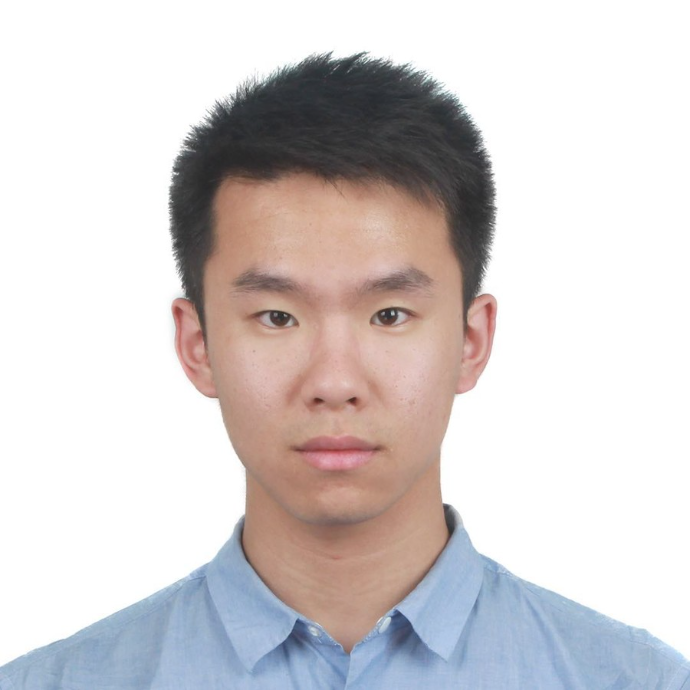
    </a> 
    <a href="https://jieyuz2.github.io/">Jieyu Zhang</a> 
    University of Washington
  

  <!-- Organizer 2 -->
  

    <a href="https://chengyuhsieh.github.io/">
      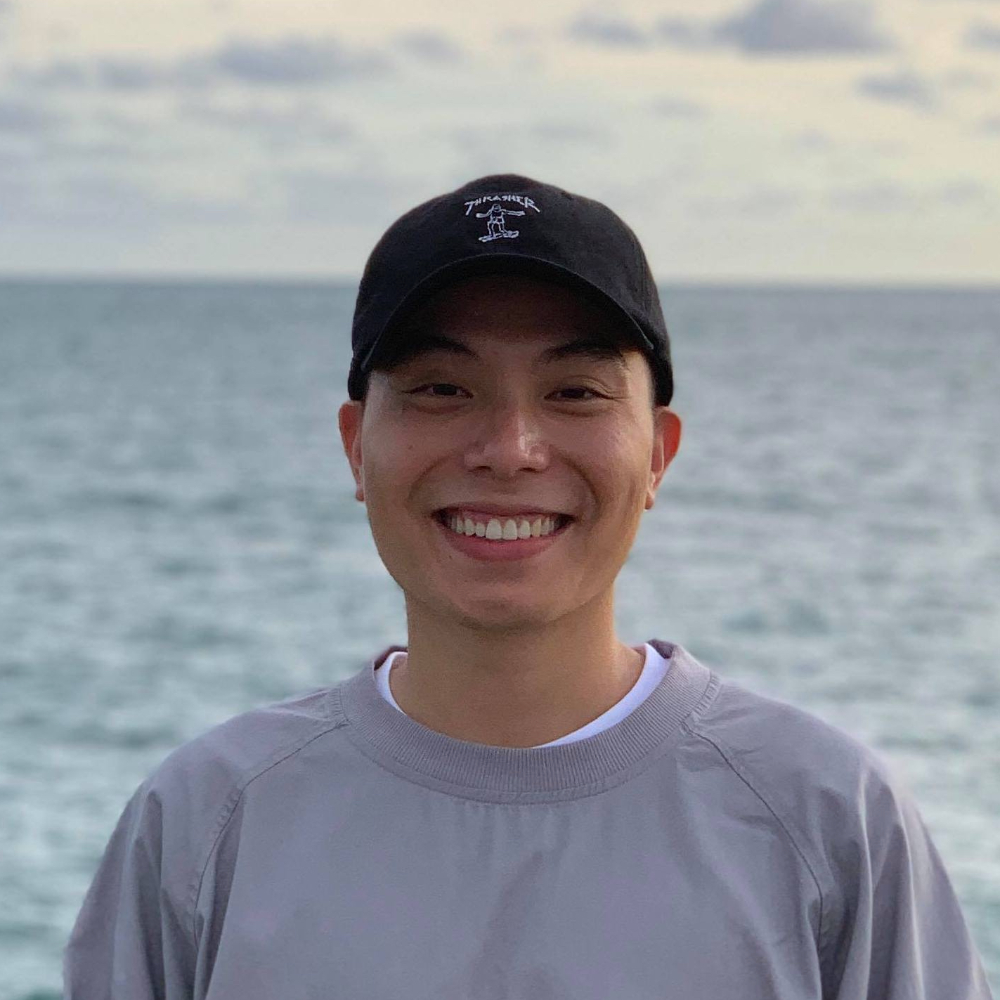
    </a> 
    <a href="https://chengyuhsieh.github.io/">Cheng-Yu Hsieh</a> 
    University of Washington
  

  <!-- Organizer 3 -->
  

    <a href="https://zixianma.github.io/">
      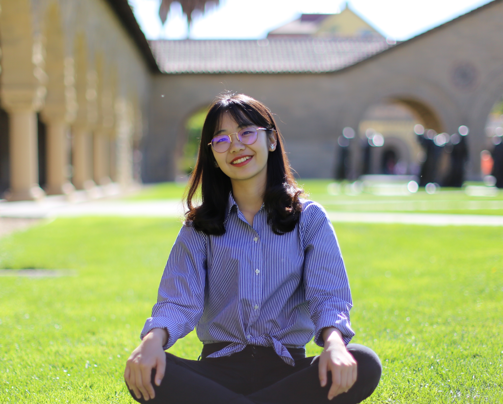
    </a> 
    <a href="https://zixianma.github.io/">Zixian Ma</a> 
    University of Washington
  

  <!-- Organizer 4 -->
  

    <a href="https://ssundaram21.github.io/">
      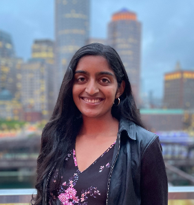
    </a> 
    <a href="https://ssundaram21.github.io/">Shobhita Sundaram</a> 
    Massachusetts Institute of Technology
  

  <!-- Organizer 5 -->
  

    <a href="https://weikaih2004.github.io/">
      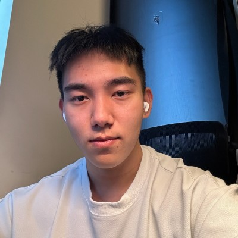
    </a> 
    <a href="https://weikaih2004.github.io/">Weikai Huang</a> 
    University of Washington
  

  <!-- Organizer 6 -->
  

     
    <a href="https://people.csail.mit.edu/weichium/">Wei-Chiu Ma</a> 
    Cornell University
  

  <!-- Organizer 7 -->
  

     
    <a href="https://web.mit.edu/phillipi/">Phillip Isola</a> 
    Massachusetts Institute of Technology
  

  <!-- Organizer 8 -->
  

     
    <a href="https://ranjaykrishna.com/index.html">Ranjay Krishna</a> 
    University of Washington
  

  

