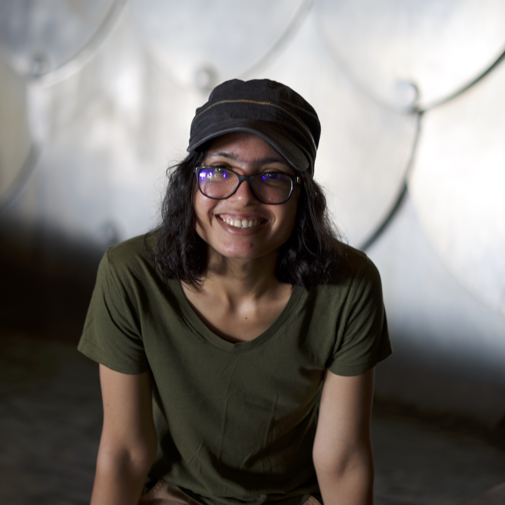

<h2 id="overview">Overview</h2>

Welcome to <strong>The 3rd Workshop on Synthetic Data for Computer Vision (SynData4CV)</strong> at CVPR 2026!

During the last decade, advances in computer vision have been catalyzed by the release of meticulously curated human-labeled datasets. Recently, people have increasingly resorted to synthetic data as an alternative to labor-intensive human-labeled datasets for its scalability, customizability, and cost-effectiveness. Synthetic data offers the potential to generate large volumes of diverse and high-quality vision data, tailored to specific scenarios and edge cases that are hard to capture in real-world data. However, challenges such as the domain gap between synthetic and real-world data, potential biases in synthetic generation, and the generalizability of models trained on synthetic data remain.

This workshop aims to provide a forum for discussion and encouragement of further exploration in these areas.

<strong>Topics of interest include, but are not limited to:</strong>

<ul>
  <li><strong>Effectiveness:</strong> What is the most effective way to generate and leverage synthetic data? Does synthetic data need to "look" realistic?</li>
  <li><strong>Efficiency and scalability:</strong> Can we make synthetic data generation more efficient and scalable without much sacrifice on the quality?</li>
  <li><strong>Benchmark and evaluation:</strong> What benchmark and evaluation methods are needed to assess the efficacy of synthetic data for computer vision?</li>
  <li><strong>Risks and ethical considerations:</strong> How can we mitigate the risks of generating and using synthetic data? How do we address relevant ethical questions, such as bias amplification in synthetic datasets?</li>
  <li><strong>Applications:</strong> What are other tasks in computer vision or other related fields (e.g., robotics, NLP) that could benefit from synthetic data?</li>
  <li><strong>Other open problems:</strong> How do we decide which type of data to use, synthetic or real-world data? What is the optimal way to combine both if both are available?</li>
</ul>

<h2 id="invited-speakers">Invited Speakers</h2>

  

    
    
<a href="https://www.cs.princeton.edu/~jiadeng/">Jia Deng</a>

    
Princeton University

  

  

    
    
<a href="https://www.cms.caltech.edu/people/georgia-gkioxari">Georgia Gkioxari</a>

    
Caltech

  

  

    
    
<a href="https://nupurkmr9.github.io/">Nupur Kumari</a>

    
Carnegie Mellon University

  

  

    
    
<a href="https://limanling.github.io/">Manling Li</a>

    
Northwestern University

  

  

    
    
<a href="https://andrewowens.com/">Andrew Owens</a>

    
Cornell Tech

  

<h2 id="schedule">Schedule</h2>

  <strong>Date:</strong>&nbsp;June 4, 2026 · Afternoon (Half day)
  <strong>Location:</strong>&nbsp;Room 607

<ol class="timeline">
  <li class="timeline__item">
    1:00 – 1:10 PM
    Opening Remarks
    Opening
  </li>
  <li class="timeline__item">
    1:10 – 1:45 PM
    Invited Talk · Manling Li
    Talk
  </li>
  <li class="timeline__item">
    1:45 – 2:20 PM
    Invited Talk · Jia Deng
    Talk
  </li>
  <li class="timeline__item">
    2:20 – 2:55 PM
    Invited Talk · Georgia Gkioxari
    Talk
  </li>
  <li class="timeline__item">
    2:55 – 3:10 PM
    Break
    Break
  </li>
  <li class="timeline__item">
    3:10 – 3:45 PM
    Invited Talk · Andrew Owens
    Talk
  </li>
  <li class="timeline__item">
    3:45 – 4:20 PM
    Invited Talk · Nupur Kumari
    Talk
  </li>
  <li class="timeline__item">
    4:20 – 4:30 PM
    Closing Remarks
    Closing
  </li>
  <li class="timeline__item">
    4:30 – 5:30 PM
    Poster Session · Boards 203–232
    Poster
  </li>
</ol>

<h2 id="awards">Awards</h2>

  
Winner · Best Short Paper

  
Beyond Raw Signals: Undecoded Generative Latents as Privileged Synthetic Data

  
Cristian Sbrolli, Nicolas Michel, Matteo Matteucci, Toshihiko Yamasaki

  
<strong>Affiliations:</strong> Politecnico di Milano; The University of Tokyo

  
Runner-up · Best Short Paper

  
WireSeg-32K: A Physics-Grounded Synthetic Dataset for Wire Instance Segmentation

  
Zilin Dai, Lehong Wang, Yi Yang, Xiang Fei

  
<strong>Affiliation:</strong> Northeastern University

<h2 id="accepted-papers">Accepted Papers <small style="font-weight:500; font-size:1rem; color:var(--c-muted); margin-left:0.5rem;">· 54 papers, sorted alphabetically · poster boards 203–232</small></h2>

  
<strong>Poster assignment:</strong> Posters are assigned alphabetically, two papers per board. Please use the board number shown next to your paper title.

  
Board-by-board poster assignments

  

    

      
Board 203

      <ol class="poster-board__papers">
        <li>
          
Addressing Data Scarcity in Depth-Based Human Action Recognition via Zero-Shot Depth Estimation

          
Rebeka Angyal, Pedro Hermosilla, Martin Kampel, Irene Ballester

        </li>
        <li>
          
AfriST-VQA: Benchmarking MLLMs for Scene-Text Visual Question Answering for African Languages

          
Henry Gagnier

        </li>
      </ol>
    

    

      
Board 204

      <ol class="poster-board__papers">
        <li>
          
Appreciate the View: A Task-Aware Evaluation Framework for Novel View Synthesis

          
Saar Stern, Ido Sobol, Or Litany

        </li>
        <li>
          
Assessing the Predictive Value of Physics-Grounded Synthetic Data for Computer Vision in Space Environments

          
Arianna Issitt, Emily Happy, Elijah Clark, Mackenzie J. Meni, Ryan T. White

        </li>
      </ol>
    

    

      
Board 205

      <ol class="poster-board__papers">
        <li>
          
Auto-Comp: Scalable Controlled Synthetic Benchmarks for VL Compositionality

          
Cristian Sbrolli, Toshihiko Yamasaki, Matteo Matteucci

        </li>
        <li>
          
Avatar4D: Synthesizing Domain-Specific 4D Humans for Real-World Pose Estimation

          
Jerrin Bright, Zhibo Wang, Dmytro Klepachevskyi, Yuhao Chen, Sirisha Rambhatla, David A. Clausi, John S. Zelek

        </li>
      </ol>
    

    

      
Board 206

      <ol class="poster-board__papers">
        <li>
          
Beyond Objects: Contextual Synthetic Data Generation for Fine-Grained Classification

          
William Yang, Xindi Wu, Zhiwei Deng, Esin Tureci, Olga Russakovsky

        </li>
        <li>
          
Beyond Photorealism: Counterfactual Synthetic Bundles for Invariant Sim-to-Real Vision

          
Murari Ambati

        </li>
      </ol>
    

    

      
Board 207

      <ol class="poster-board__papers">
        <li>
          
Beyond Raw Signals: Undecoded Generative Latents as Privileged Synthetic Data

          
Cristian Sbrolli, Nicolas Michel, Matteo Matteucci, Toshihiko Yamasaki

        </li>
        <li>
          
Completing Missing Modalities: Synthetic Data for RGB–Infrared–Thermal–Text Person Re-Identification

          
Muhammad Umair, Muhammad Hammad Musaddiq, Jun Zhou, Ahmad Muhammad

        </li>
      </ol>
    

    

      
Board 208

      <ol class="poster-board__papers">
        <li>
          
CryoDiff: Cryo-EM Synthesis via Biophysics and Cycle-Consistent Diffusion

          
Genpei Zhang, Yuntian Yang, Siqi Wu, Ningyan Zhang, Seonghui Min, Jie Wu, Christopher Braxton Owens, Minhao Wu, Wanyue Feng, Gus LW Hart, Runmin Jiang, Min Xu

        </li>
        <li>
          
Diffusion-Augmented Coreset Expansion for Scalable Dataset Distillation

          
Ali Abbasi, Shima Imani, Chenyang An, Gayathri Mahalingam, Harsh Shrivastava, Maurice Diesendruck, Hamed Pirsiavash, Pramod Sharma, Soheil Kolouri

        </li>
      </ol>
    

    

      
Board 209

      <ol class="poster-board__papers">
        <li>
          
Disentangled Anatomy-Disease Diffusion (DADD) for Controllable Ulcerative Colitis Progression Synthesis

          
Umut Dundar, Alptekin Temizel

        </li>
        <li>
          
Durian: Dual Reference Image-Guided Portrait Animation with Attribute Transfer

          
Hyunsoo Cha, Byungjun Kim, Hanbyul Joo

        </li>
      </ol>
    

    

      
Board 210

      <ol class="poster-board__papers">
        <li>
          
Evaluating the Trade-offs of MDL-to-UsdPreviewSurface Material Simplification in NVIDIA Isaac Sim: Visual Quality, Feature Preservation, and AI Task Performance

          
Zihou Zhu, Mei Haitao, Haolong Zheng, Zhou Zhang

        </li>
        <li>
          
Few-Shot Synthetic Data Generation with Diffusion Models for Downstream Vision Tasks

          
Daniil Dushenev, Nazariy Karpov, Daniil Zinovjev, Alexander Gorin, Konstantin Kulikov

        </li>
      </ol>
    

    

      
Board 211

      <ol class="poster-board__papers">
        <li>
          
Fréchet Inception Distance is Failing to Preserve Rank Consistency for Synthetic Out-of-Distribution Samples

          
Linghui Liu, Henrike Stephani, Janis Keuper

        </li>
        <li>
          
Generating Synthetic Illumination Variation with Co-Located Relighting

          
Yash Turkar, Karthik K Dantu

        </li>
      </ol>
    

    

      
Board 212

      <ol class="poster-board__papers">
        <li>
          
Grounding Synthetic Data Generation With Vision and Language Models

          
Ümit Mert Çağlar, Alptekin Temizel

        </li>
        <li>
          
How Far Can We Go With Synthetic Data for Audio-Visual Sound Source Localization?

          
Arda Senocak, Sooyoung Park, Tae-Hyun Oh, Joon Son Chung

        </li>
      </ol>
    

    

      
Board 213

      <ol class="poster-board__papers">
        <li>
          
Hybrid Rendering for Multimodal Autonomous Driving: Merging Neural and Physics-Based Simulation

          
Máté Tóth, Péter Kovács, Réka Bencses, Zoltan Bendefy, Zoltan Hortsin, Balázs Teréki, Tamas Matuszka

        </li>
        <li>
          
iARCS: Iterative Agentic RL for Controllable 3D Scene Generation

          
Saugat Adhikari, Ashok Prasad Neupane, Pramish Paudel, Ajad Chhatkuli, Danda Pani Paudel

        </li>
      </ol>
    

    

      
Board 214

      <ol class="poster-board__papers">
        <li>
          
Masked Language Prompting for Generative Data Augmentation in Few-shot Fashion Style Recognition

          
Yuki Hirakawa, Ryotaro Shimizu

        </li>
        <li>
          
Multi-Objective Photoreal Simulation (MOPS) Dataset for Computer Vision in Robot Manipulation

          
Maximilian Xiling Li, Paul Mattes, Nils Blank, Rudolf Lioutikov

        </li>
      </ol>
    

    

      
Board 215

      <ol class="poster-board__papers">
        <li>
          
Narrowing the Performance Gap in Synthetic VLM Pre-training via Multi-Generator Ensembles

          
Leonardo Brusini, Cristian Sbrolli, Eugenio Lomurno, Toshihiko Yamasaki, Matteo Matteucci

        </li>
        <li>
          
Object-Centric Data Synthesis for Category-level Object Detection

          
Vikhyat Agarwal, Jiayi Cora Guo, Declan Hoban, Sissi Yuxi Zhang, Nick Moran, Peter Cho, Srilakshmi Pattabiraman, Shantanu H. Joshi

        </li>
      </ol>
    

    

      
Board 216

      <ol class="poster-board__papers">
        <li>
          
One Category One Prompt: Dataset Distillation using Diffusion Models

          
Ali Abbasi, Ashkan Shahbazi, Hamed Pirsiavash, Soheil Kolouri

        </li>
        <li>
          
OrbitArch

          
I-Ting Tsai, Bharath Hariharan

        </li>
      </ol>
    

    

      
Board 217

      <ol class="poster-board__papers">
        <li>
          
Personalized Generative Models for Contextual Debiasing

          
Xinran Liang, Esin Tureci, Prachi Sinha, Ye Zhu, Vikram V. Ramaswamy, Olga Russakovsky

        </li>
        <li>
          
PLLM: Pseudo-Labeling Large Language Models for CAD Program Synthesis

          
Yuanbo Li, Dule Shu, Yan-Ying Chen, Matthew Klenk, Daniel Ritchie

        </li>
      </ol>
    

    

      
Board 218

      <ol class="poster-board__papers">
        <li>
          
Privacy-Aware Synthetic Video Benchmarking and Relational Evaluation for Worker-Under-Suspended-Load Detection

          
Anshu Singh, Alejandro Seif

        </li>
        <li>
          
ProductConsistency: Improving Product Identity Preservation in Instruction-Based Image Editing via SFT and RL

          
Mukund Khanna, Raj Singh Yadav, Kunal Singh

        </li>
      </ol>
    

    

      
Board 219

      <ol class="poster-board__papers">
        <li>
          
RareCrafter: Controllable Generative Augmentation for Rare Object Detection in Driving Scenes

          
Mohadeseh Ghafoori, Danielle Lee, Kurt Hammen, Collin Meese, Mark Nejad

        </li>
        <li>
          
Realiz3D: 3D Generation Made Photorealistic via Domain-Aware Learning

          
Ido Sobol, Kihyuk Sohn, Yoav Blum, Egor Zakharov, Max Bluvstein, Andrea Vedaldi, Or Litany

        </li>
      </ol>
    

    

      
Board 220

      <ol class="poster-board__papers">
        <li>
          
Representation-Conditioned Diffusion Models for Guided Training Data Generation

          
Nithesh Chandher Karthikeyan, Jonas Unger, Gabriel Eilertsen

        </li>
        <li>
          
Restereo: Unifying diffusion stereo video generation and restoration

          
Xingchang Huang, Ashish Kumar Singh, Florian Dubost, Cristina Nader Vasconcelos, Sakar Khattar, Liang Shi, Christian Theobalt, Cengiz Oztireli, Gurprit Singh

        </li>
      </ol>
    

    

      
Board 221

      <ol class="poster-board__papers">
        <li>
          
SAIL: Similarity-Aware Guidance and Inter-Caption Augmentation-based Learning for Weakly-Supervised Dense Video Captioning

          
Ye-Chan Kim, SeungJu Cha, Si-Woo Kim, MinJu Jeon, HyunGee Kim, Dong-Jin Kim

        </li>
        <li>
          
Scaling Up 3D Forest Vision with Synthetic LiDAR

          
Yihang She, Andrew Blake, David Coomes, Srinivasan Keshav

        </li>
      </ol>
    

    

      
Board 222

      <ol class="poster-board__papers">
        <li>
          
Sea-Mie: Physically-Based Synthetic Fog for Maritime Image Defogging via Curriculum Learning

          
Stelios Avlakiotis, Peter Ter Heerdt, Thomas De Kerf, Steve Vanlanduit

        </li>
        <li>
          
Sequential Dataset for Satellite Pose Estimation and a Frequency-Space Neural Operator for HIL-Free Generalization Benchmarking

          
Woojin Cho, Junghwan Park, Steve Andreas Immanuel, JunminPark, Seokhyun Chin, Jiayun Wang

        </li>
      </ol>
    

    

      
Board 223

      <ol class="poster-board__papers">
        <li>
          
Sim-to-Real Metrology: Calibrated Digital Twins for Fringe Projection Profilometry

          
NOBLE AUSTINE, Vuppu Eshwar Sai, Vaishnavi Ravi, Madhu S. Nair, Gorthi Rama Krishna Sai Subrahmanyam

        </li>
        <li>
          
SJEPA: Joint Embedding Predictive Architecture for Synthetic-to-Real Alignment

          
Shentong Mo

        </li>
      </ol>
    

    

      
Board 224

      <ol class="poster-board__papers">
        <li>
          
Structure-Consistent Joint Image-Mask Synthesis for Data-Scarce Medical Image Segmentation

          
Ningyan Zhang, Weiyi Zhang, Mostofa Rafid Uddin, Xingjian Li, Min Xu

        </li>
        <li>
          
Structure-retained low-rank adapters for weather synthesis

          
Shunxin Wang, Alexandros Stergiou, Luuk Spreeuwers, Estefania Talavera, Nicola Strisciuglio

        </li>
      </ol>
    

    

      
Board 225

      <ol class="poster-board__papers">
        <li>
          
StyleText: A Large-Scale Dataset and Benchmark for Stylized Scene Text Inpainting

          
Aleksandr Simonyan, Nipun Jindal

        </li>
        <li>
          
Synthetic Data Generation for Long-Tail Medical Image Classification: A Case Study in Skin Lesions

          
Jiaxiang Jiang, Mahesh Subedar, Omesh Tickoo

        </li>
      </ol>
    

    

      
Board 226

      <ol class="poster-board__papers">
        <li>
          
Synthetic Designed Experiments for Diagnosing Vision Model Failures

          
Krisanu Sarkar

        </li>
        <li>
          
Theory of Space: Evaluating Active Spatial Belief Construction in Foundation Models with Synthetic 3D Environments

          
Pingyue Zhang, Zihan Huang, Yue Wang, Jieyu Zhang, Letian Xue, Zihan Wang, Qineng Wang, Keshigeyan Chandrasegaran, Ruohan Zhang, Yejin Choi, Ranjay Krishna, Jiajun Wu, Li Fei-Fei, Manling Li

        </li>
      </ol>
    

    

      
Board 227

      <ol class="poster-board__papers">
        <li>
          
Vanast: Virtual Try-On with Human Image Animation via Synthetic Triplet Supervision

          
Hyunsoo Cha, Wonjung Woo, Byungjun Kim, Hanbyul Joo

        </li>
        <li>
          
Video-Consistent Synthetic Skiing Trajectories

          
M&amp;#x27;Saydez Campbell, Rémi Emonet, Damien Muselet, Christophe Ducottet

        </li>
      </ol>
    

    

      
Board 228

      <ol class="poster-board__papers">
        <li>
          
WaterGen: Decoupling Scene and Medium in Underwater Image Generation

          
Jiayi Wu, Tianfu Wang, Tianyi Xiong, Dehao Yuan, Xiaomin Lin, Md Jahidul Islam, Cornelia Fermuller, Christopher Metzler, Yiannis Aloimonos

        </li>
        <li>
          
When Does Synthetic Data Help? A Spectral Theory of Task-Relevant Domain Gap with Applications to Guided Generation and Bias Auditing

          
Kaustubh S. Bukkapatnam, Rayan Malik

        </li>
      </ol>
    

    

      
Board 229

      <ol class="poster-board__papers">
        <li>
          
Why Training with Synthetic Data Fails for OOD: Distribution Gap Amplifies Noise Misalignment in Diffusion Models

          
Ying Hua, Jessica Bader, Jae Myung Kim, Zeynep Akata

        </li>
        <li>
          
WireSeg-32K: A Physics-Grounded Synthetic Dataset for Wire Instance Segmentation

          
Zilin Dai, Lehong Wang, Yi Yang, Xiang Fei

        </li>
      </ol>
    

    

      
Board 230

      
Reserved / overflow

    

    

      
Board 231

      
Reserved / overflow

    

    

      
Board 232

      
Reserved / overflow

    

  

<ol class="papers">
  <li class="paper">
    
Addressing Data Scarcity in Depth-Based Human Action Recognition via Zero-Shot Depth Estimation#203

    
Rebeka Angyal, Pedro Hermosilla, Martin Kampel, Irene Ballester

  </li>
  <li class="paper">
    
AfriST-VQA: Benchmarking MLLMs for Scene-Text Visual Question Answering for African Languages#203

    
Henry Gagnier

  </li>
  <li class="paper">
    
Appreciate the View: A Task-Aware Evaluation Framework for Novel View Synthesis#204

    
Saar Stern, Ido Sobol, Or Litany

  </li>
  <li class="paper">
    
Assessing the Predictive Value of Physics-Grounded Synthetic Data for Computer Vision in Space Environments#204

    
Arianna Issitt, Emily Happy, Elijah Clark, Mackenzie J. Meni, Ryan T. White

  </li>
  <li class="paper">
    
Auto-Comp: Scalable Controlled Synthetic Benchmarks for VL Compositionality#205

    
Cristian Sbrolli, Toshihiko Yamasaki, Matteo Matteucci

  </li>
  <li class="paper">
    
Avatar4D: Synthesizing Domain-Specific 4D Humans for Real-World Pose Estimation#205

    
Jerrin Bright, Zhibo Wang, Dmytro Klepachevskyi, Yuhao Chen, Sirisha Rambhatla, David A. Clausi, John S. Zelek

  </li>
  <li class="paper">
    
Beyond Objects: Contextual Synthetic Data Generation for Fine-Grained Classification#206

    
William Yang, Xindi Wu, Zhiwei Deng, Esin Tureci, Olga Russakovsky

  </li>
  <li class="paper">
    
Beyond Photorealism: Counterfactual Synthetic Bundles for Invariant Sim-to-Real Vision#206

    
Murari Ambati

  </li>
  <li class="paper">
    
Beyond Raw Signals: Undecoded Generative Latents as Privileged Synthetic Data#207

    
Cristian Sbrolli, Nicolas Michel, Matteo Matteucci, Toshihiko Yamasaki

  </li>
  <li class="paper">
    
Completing Missing Modalities: Synthetic Data for RGB–Infrared–Thermal–Text Person Re-Identification#207

    
Muhammad Umair, Muhammad Hammad Musaddiq, Jun Zhou, Ahmad Muhammad

  </li>
  <li class="paper">
    
CryoDiff: Cryo-EM Synthesis via Biophysics and Cycle-Consistent Diffusion#208

    
Genpei Zhang, Yuntian Yang, Siqi Wu, Ningyan Zhang, Seonghui Min, Jie Wu, Christopher Braxton Owens, Minhao Wu, Wanyue Feng, Gus LW Hart, Runmin Jiang, Min Xu

  </li>
  <li class="paper">
    
Diffusion-Augmented Coreset Expansion for Scalable Dataset Distillation#208

    
Ali Abbasi, Shima Imani, Chenyang An, Gayathri Mahalingam, Harsh Shrivastava, Maurice Diesendruck, Hamed Pirsiavash, Pramod Sharma, Soheil Kolouri

  </li>
  <li class="paper">
    
Disentangled Anatomy-Disease Diffusion (DADD) for Controllable Ulcerative Colitis Progression Synthesis#209

    
Umut Dundar, Alptekin Temizel

  </li>
  <li class="paper">
    
Durian: Dual Reference Image-Guided Portrait Animation with Attribute Transfer#209

    
Hyunsoo Cha, Byungjun Kim, Hanbyul Joo

  </li>
  <li class="paper">
    
Evaluating the Trade-offs of MDL-to-UsdPreviewSurface Material Simplification in NVIDIA Isaac Sim: Visual Quality, Feature Preservation, and AI Task Performance#210

    
Zihou Zhu, Mei Haitao, Haolong Zheng, Zhou Zhang

  </li>
  <li class="paper">
    
Few-Shot Synthetic Data Generation with Diffusion Models for Downstream Vision Tasks#210

    
Daniil Dushenev, Nazariy Karpov, Daniil Zinovjev, Alexander Gorin, Konstantin Kulikov

  </li>
  <li class="paper">
    
Fréchet Inception Distance is Failing to Preserve Rank Consistency for Synthetic Out-of-Distribution Samples#211

    
Linghui Liu, Henrike Stephani, Janis Keuper

  </li>
  <li class="paper">
    
Generating Synthetic Illumination Variation with Co-Located Relighting#211

    
Yash Turkar, Karthik K Dantu

  </li>
  <li class="paper">
    
Grounding Synthetic Data Generation With Vision and Language Models#212

    
Ümit Mert Çağlar, Alptekin Temizel

  </li>
  <li class="paper">
    
How Far Can We Go With Synthetic Data for Audio-Visual Sound Source Localization?#212

    
Arda Senocak, Sooyoung Park, Tae-Hyun Oh, Joon Son Chung

  </li>
  <li class="paper">
    
Hybrid Rendering for Multimodal Autonomous Driving: Merging Neural and Physics-Based Simulation#213

    
Máté Tóth, Péter Kovács, Réka Bencses, Zoltan Bendefy, Zoltan Hortsin, Balázs Teréki, Tamas Matuszka

  </li>
  <li class="paper">
    
iARCS: Iterative Agentic RL for Controllable 3D Scene Generation#213

    
Saugat Adhikari, Ashok Prasad Neupane, Pramish Paudel, Ajad Chhatkuli, Danda Pani Paudel

  </li>
  <li class="paper">
    
Masked Language Prompting for Generative Data Augmentation in Few-shot Fashion Style Recognition#214

    
Yuki Hirakawa, Ryotaro Shimizu

  </li>
  <li class="paper">
    
Multi-Objective Photoreal Simulation (MOPS) Dataset for Computer Vision in Robot Manipulation#214

    
Maximilian Xiling Li, Paul Mattes, Nils Blank, Rudolf Lioutikov

  </li>
  <li class="paper">
    
Narrowing the Performance Gap in Synthetic VLM Pre-training via Multi-Generator Ensembles#215

    
Leonardo Brusini, Cristian Sbrolli, Eugenio Lomurno, Toshihiko Yamasaki, Matteo Matteucci

  </li>
  <li class="paper">
    
Object-Centric Data Synthesis for Category-level Object Detection#215

    
Vikhyat Agarwal, Jiayi Cora Guo, Declan Hoban, Sissi Yuxi Zhang, Nick Moran, Peter Cho, Srilakshmi Pattabiraman, Shantanu H. Joshi

  </li>
  <li class="paper">
    
One Category One Prompt: Dataset Distillation using Diffusion Models#216

    
Ali Abbasi, Ashkan Shahbazi, Hamed Pirsiavash, Soheil Kolouri

  </li>
  <li class="paper">
    
OrbitArch#216

    
I-Ting Tsai, Bharath Hariharan

  </li>
  <li class="paper">
    
Personalized Generative Models for Contextual Debiasing#217

    
Xinran Liang, Esin Tureci, Prachi Sinha, Ye Zhu, Vikram V. Ramaswamy, Olga Russakovsky

  </li>
  <li class="paper">
    
PLLM: Pseudo-Labeling Large Language Models for CAD Program Synthesis#217

    
Yuanbo Li, Dule Shu, Yan-Ying Chen, Matthew Klenk, Daniel Ritchie

  </li>
  <li class="paper">
    
Privacy-Aware Synthetic Video Benchmarking and Relational Evaluation for Worker-Under-Suspended-Load Detection#218

    
Anshu Singh, Alejandro Seif

  </li>
  <li class="paper">
    
ProductConsistency: Improving Product Identity Preservation in Instruction-Based Image Editing via SFT and RL#218

    
Mukund Khanna, Raj Singh Yadav, Kunal Singh

  </li>
  <li class="paper">
    
RareCrafter: Controllable Generative Augmentation for Rare Object Detection in Driving Scenes#219

    
Mohadeseh Ghafoori, Danielle Lee, Kurt Hammen, Collin Meese, Mark Nejad

  </li>
  <li class="paper">
    
Realiz3D: 3D Generation Made Photorealistic via Domain-Aware Learning#219

    
Ido Sobol, Kihyuk Sohn, Yoav Blum, Egor Zakharov, Max Bluvstein, Andrea Vedaldi, Or Litany

  </li>
  <li class="paper">
    
Representation-Conditioned Diffusion Models for Guided Training Data Generation#220

    
Nithesh Chandher Karthikeyan, Jonas Unger, Gabriel Eilertsen

  </li>
  <li class="paper">
    
Restereo: Unifying diffusion stereo video generation and restoration#220

    
Xingchang Huang, Ashish Kumar Singh, Florian Dubost, Cristina Nader Vasconcelos, Sakar Khattar, Liang Shi, Christian Theobalt, Cengiz Oztireli, Gurprit Singh

  </li>
  <li class="paper">
    
SAIL: Similarity-Aware Guidance and Inter-Caption Augmentation-based Learning for Weakly-Supervised Dense Video Captioning#221

    
Ye-Chan Kim, SeungJu Cha, Si-Woo Kim, MinJu Jeon, HyunGee Kim, Dong-Jin Kim

  </li>
  <li class="paper">
    
Scaling Up 3D Forest Vision with Synthetic LiDAR#221

    
Yihang She, Andrew Blake, David Coomes, Srinivasan Keshav

  </li>
  <li class="paper">
    
Sea-Mie: Physically-Based Synthetic Fog for Maritime Image Defogging via Curriculum Learning#222

    
Stelios Avlakiotis, Peter Ter Heerdt, Thomas De Kerf, Steve Vanlanduit

  </li>
  <li class="paper">
    
Sequential Dataset for Satellite Pose Estimation and a Frequency-Space Neural Operator for HIL-Free Generalization Benchmarking#222

    
Woojin Cho, Junghwan Park, Steve Andreas Immanuel, JunminPark, Seokhyun Chin, Jiayun Wang

  </li>
  <li class="paper">
    
Sim-to-Real Metrology: Calibrated Digital Twins for Fringe Projection Profilometry#223

    
NOBLE AUSTINE, Vuppu Eshwar Sai, Vaishnavi Ravi, Madhu S. Nair, Gorthi Rama Krishna Sai Subrahmanyam

  </li>
  <li class="paper">
    
SJEPA: Joint Embedding Predictive Architecture for Synthetic-to-Real Alignment#223

    
Shentong Mo

  </li>
  <li class="paper">
    
Structure-Consistent Joint Image-Mask Synthesis for Data-Scarce Medical Image Segmentation#224

    
Ningyan Zhang, Weiyi Zhang, Mostofa Rafid Uddin, Xingjian Li, Min Xu

  </li>
  <li class="paper">
    
Structure-retained low-rank adapters for weather synthesis#224

    
Shunxin Wang, Alexandros Stergiou, Luuk Spreeuwers, Estefania Talavera, Nicola Strisciuglio

  </li>
  <li class="paper">
    
StyleText: A Large-Scale Dataset and Benchmark for Stylized Scene Text Inpainting#225

    
Aleksandr Simonyan, Nipun Jindal

  </li>
  <li class="paper">
    
Synthetic Data Generation for Long-Tail Medical Image Classification: A Case Study in Skin Lesions#225

    
Jiaxiang Jiang, Mahesh Subedar, Omesh Tickoo

  </li>
  <li class="paper">
    
Synthetic Designed Experiments for Diagnosing Vision Model Failures#226

    
Krisanu Sarkar

  </li>
  <li class="paper">
    
Theory of Space: Evaluating Active Spatial Belief Construction in Foundation Models with Synthetic 3D Environments#226

    
Pingyue Zhang, Zihan Huang, Yue Wang, Jieyu Zhang, Letian Xue, Zihan Wang, Qineng Wang, Keshigeyan Chandrasegaran, Ruohan Zhang, Yejin Choi, Ranjay Krishna, Jiajun Wu, Li Fei-Fei, Manling Li

  </li>
  <li class="paper">
    
Vanast: Virtual Try-On with Human Image Animation via Synthetic Triplet Supervision#227

    
Hyunsoo Cha, Wonjung Woo, Byungjun Kim, Hanbyul Joo

  </li>
  <li class="paper">
    
Video-Consistent Synthetic Skiing Trajectories#227

    
M&#x27;Saydez Campbell, Rémi Emonet, Damien Muselet, Christophe Ducottet

  </li>
  <li class="paper">
    
WaterGen: Decoupling Scene and Medium in Underwater Image Generation#228

    
Jiayi Wu, Tianfu Wang, Tianyi Xiong, Dehao Yuan, Xiaomin Lin, Md Jahidul Islam, Cornelia Fermuller, Christopher Metzler, Yiannis Aloimonos

  </li>
  <li class="paper">
    
When Does Synthetic Data Help? A Spectral Theory of Task-Relevant Domain Gap with Applications to Guided Generation and Bias Auditing#228

    
Kaustubh S. Bukkapatnam, Rayan Malik

  </li>
  <li class="paper">
    
Why Training with Synthetic Data Fails for OOD: Distribution Gap Amplifies Noise Misalignment in Diffusion Models#229

    
Ying Hua, Jessica Bader, Jae Myung Kim, Zeynep Akata

  </li>
  <li class="paper">
    
WireSeg-32K: A Physics-Grounded Synthetic Dataset for Wire Instance Segmentation#229

    
Zilin Dai, Lehong Wang, Yi Yang, Xiang Fei

  </li>
</ol>

<h2 id="call-for-papers">Call for Papers</h2>

We invite submissions on topics related to synthetic data for computer vision, including but not limited to:

<ul>
  <li>Novel methods for generating synthetic data</li>
  <li>Techniques for bridging the domain gap between synthetic and real data</li>
  <li>Benchmarks and evaluation metrics for synthetic data</li>
  <li>Applications of synthetic data in various computer vision tasks</li>
  <li>Ethical considerations and bias mitigation in synthetic data generation</li>
  <li>Efficient and scalable synthetic data generation pipelines</li>
</ul>

<strong>Submission Guidelines:</strong>

<ul>
  <li>Papers should be formatted according to the CVPR 2026 template</li>
  <li>Short papers: 4 pages (excluding references); Long papers: 8 pages (excluding references)</li>
  <li>Submissions should be made through <a href="https://openreview.net/group?id=thecvf.com/CVPR/2026/Workshop/SynData4CV">OpenReview</a></li>
  <li>All submissions will be double-blind reviewed</li>
  <li><strong>Accepted papers will NOT be included in CVPR proceedings</strong>, so there are no double submission concerns.</li>
</ul>

<h2 id="important-workshop-dates">Important Workshop Dates</h2>

<ul class="dates">
  <li class="date-card">
    
Submission Opens

    
February 25, 2026

  </li>
  <li class="date-card date-card--key">
    
Submission Deadline

    
March 17, 2026 · 11:59 AM UTC

  </li>
  <li class="date-card">
    
Notification

    
TBD

  </li>
  <li class="date-card">
    
Camera Ready

    
TBD

  </li>
  <li class="date-card date-card--key">
    
Workshop Date

    
June 4, 2026 · Room 607

  </li>
</ul>

<h2 id="related-workshops">Related Workshops</h2>

<ul class="workshops">
  <li><a href="./cvpr2025.html">Synthetic Data for Computer Vision @ CVPR 2025</a></li>
  <li><a href="./cvpr2024.html">Synthetic Data for Computer Vision @ CVPR 2024</a></li>
  <li><a href="https://syntml-cvpr2022-workshop.github.io/">Machine Learning with Synthetic Data @ CVPR 2022</a></li>
  <li><a href="https://sites.google.com/view/sdas2023/">Synthetic Data for Autonomous Systems @ CVPR 2023</a></li>
  <li><a href="https://www.syntheticdata4ml.vanderschaar-lab.com/">Synthetic Data Generation with Generative AI @ NeurIPS 2023</a></li>
</ul>

<h2 id="organizers">Organizers</h2>

  

    
    
<a href="https://jieyuz2.github.io/">Jieyu Zhang</a>

    
University of Washington

  

  

    
    
<a href="https://weikaih04.github.io/">Weikai Huang</a>

    
University of Washington

  

  

    
    
<a href="https://zixianma.github.io/">Zixian Ma</a>

    
University of Washington

  

  

    
    
<a href="https://red-fairy.github.io/">Rundong Luo</a>

    
Cornell University

  

  

    
    
<a href="https://ssundaram21.github.io/">Shobhita Sundaram</a>

    
Massachusetts Institute of Technology

  

  

    
    
<a href="https://people.csail.mit.edu/weichium/">Wei-Chiu Ma</a>

    
Cornell University

  

  

    
    
<a href="https://ranjaykrishna.com/index.html">Ranjay Krishna</a>

    
University of Washington

  

