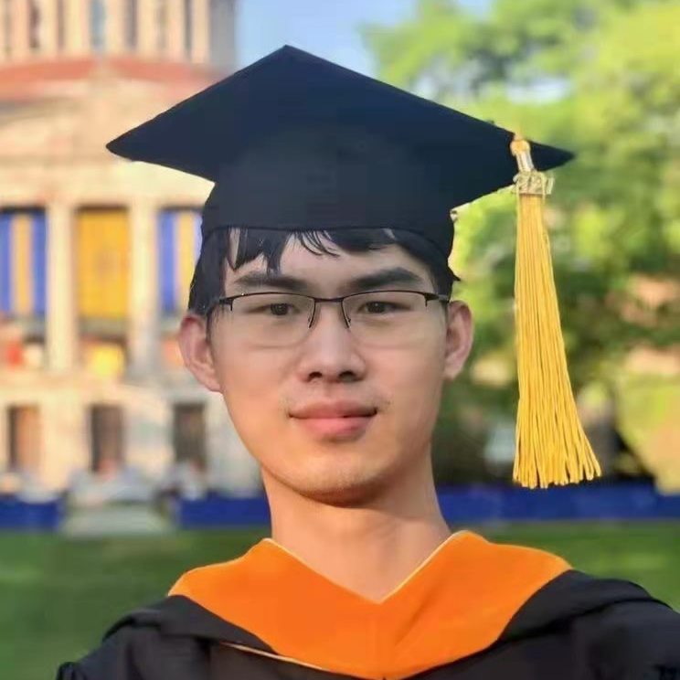
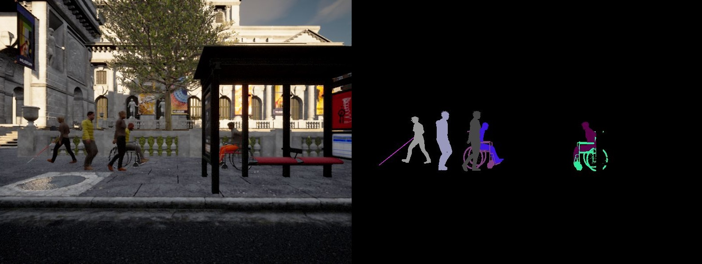
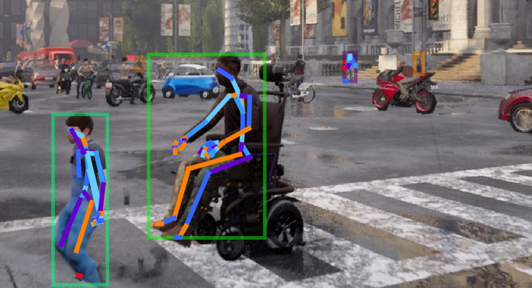

# Overview

The workshop aims to explore the use of synthetic data in training and evaluating computer vision models, as well as in other related domains. During the last decade, advancements in computer vision were catalyzed by the release of painstakingly curated human-labeled datasets. Recently, people have increasingly resorted to synthetic data as an alternative to laborintensive human-labeled datasets for its scalability, customizability, and costeffectiveness. Synthetic data offers the potential to generate large volumes of diverse and high-quality vision data, tailored to specific scenarios and edge cases that are hard to capture in real-world data. However, challenges such as the domain gap between synthetic and real-world data, potential biases in synthetic generation, and ensuring the generalizability of models trained on synthetic data remain. We hope the workshop can provide a forum to discuss and encourage further exploration in these areas.

# Invited Speakers 
* The speakers haven't been finalized, stay tuned for updates!

  

     
  <a href="https://www.3dunderstanding.org/">Angela Dai</a> 
    Technical University of Munich
  

  

  

  
   

     
  <a href="https://www.cs.cornell.edu/~bharathh/">Bharath Hariharan</a> 
    Cornell University
  

   

     
  <a href="https://boleizhou.github.io/">Bolei Zhou</a> 
    University of California, Los Angeles
  

  
  

     
  <a href="https://www.cs.princeton.edu/~jiadeng/"> Jia Deng</a> 
    Princeton University
  

  

     
    <a href="https://kianaehsani.com/">Kiana Ehsani</a> 
    Vercept
  

  

     
  <a href="https://yael-vinker.github.io/website/">Yael Vinker</a> 
    Massachusetts Institute of Technology
  

  

   
   
  

# Schedule
Workshop date: June 11th, 2025 (Full day) <b>Location: Grand C2</b>
<table>
  <tr>
    <td>09:00 - 09:20</td>
    <td>Opening (Jieyu Zhang)</td>
  </tr>
  <tr>
    <td>09:20 - 10:00</td>
    <td>Talk by Yael Vinker</td>
  </tr>
  <tr>
    <td>10:00 - 10:40</td>
    <td>Talk by Kiana Ehsani</td>
  </tr>
  <tr>
    <td>10:40 - 11:00</td>
    <td>Break</td>
  </tr>
  <tr>
    <td>11:00 - 11:40</td>
    <td>Talk by Jia Deng</td>
  </tr>
  <tr>
    <td>11:40 - 13:00</td>
    <td>Lunch</td>
  </tr>
  <tr>
    <td>13:00 - 14:30</td>
    <td>Poster Session</td>
  </tr>
  <tr>
    <td>14:30 - 15:10</td>
    <td>Talk by Bolei Zhou</td>
  </tr>
  <tr>
    <td>15:10 - 15:50</td>
    <td>Talk by Bharath Hariharan</td>
  </tr>
  <tr>
    <td>15:50 - 16:10</td>
    <td>Break</td>
  </tr>
  <tr>
    <td>16:10 - 16:50</td>
    <td>Talk by Angela Dai</td>
  </tr>
  <tr>
    <td>16:50 - 17:20</td>
    <td>Closing (Zixian Ma)</td>
  </tr>
</table>

# Poster Session
* Stay tuned for updates!

# Awards
* Stay tuned for updates!

# Accepted Papers (sorted by alphabet)
<table>
<tr><td><a href="https://openreview.net/forum?id=4ygxQu5sLD">ACTUPose: Active Curriculum Training for Unsupervised Domain Adaptation in Pose Estimation</a>. Isha Dua, Arjun Sharma, Shuaib Ahmed, Rahul Tallamraju</td></tr>
<tr><td><a href="https://openreview.net/forum?id=MctBpV4isI">Analyze, Generate, Improve: Failure-Based Data Generation for Large Multimodal Models</a>. Gabriela Ben-Melech Stan, Estelle Aflalo, Avinash Madasu, Vasudev Lal, Phillip Howard</td></tr>
<tr><td><a href="https://openreview.net/forum?id=miyfwh8sKb">Ano-Skin: Clinical Feature-Aware Diffusion Model for  Dermatological Image Anonymization</a>. YeonGyu Han, Jung Im Na, Seong Hwan Kim, Dongheon Lee</td></tr>
<tr><td><a href="https://openreview.net/forum?id=sRh6ZMebXJ">Applying Longitudinal Augmentation and Data Generation (LAUGEN) in Medical Imaging</a>. Nico Disch, Balint Kovacs, Constantin Ulrich, Robin Peretzke, Saikat Roy, Maximilian Rouven Rokuss, Yannick Kirchhoff, David Zimmerer, Klaus Maier-Hein</td></tr>
<tr><td><a href="https://openreview.net/forum?id=mPqVEApjIw">Are Synthetic Corruptions A Reliable Proxy For Real-World Corruptions?</a>. Shashank Agnihotri, David Schader, Nico Sharei, Mehmet Ege Kaçar, Margret Keuper</td></tr>
<tr><td><a href="https://openreview.net/forum?id=rwACYTdvVM">Ask, Pose, Unite: Scaling Data Acquisition for Close Interaction Meshes with Vision Language Models</a>. Laura Bravo-Sánchez, Jaewoo Heo, Zhenzhen Weng, Kuan-Chieh Wang</td></tr>
<tr><td><a href="https://openreview.net/forum?id=UyPo2zzagc">BLIP3-KALE: Knowledge Augmented Large-Scale Dense Captions</a>. Anas Awadalla, Le Xue, Manli Shu, An Yan, Jun Wang, Senthil Purushwalkam, Sheng Shen, Hannah Lee, Oscar Lo, Jae Sung Park, Etash Kumar Guha, Silvio Savarese, Ludwig Schmidt, Yejin Choi, Caiming Xiong, +1 more author</td></tr>
<tr><td><a href="https://openreview.net/forum?id=yUB4MibBqn">Boosting Synthetic Data for VLMs via Diffusion Noise Optimization</a>. Ren Ohkubo, Rintaro Yanagi, Hirokatsu Kataoka, Yutaka Satoh</td></tr>
<tr><td><a href="https://openreview.net/forum?id=sb6ke6gIo3">Bounding Box-Guided Diffusion for Synthesizing Industrial Images and Segmentation Maps</a>. Alessandro Simoni, Francesco Pelosin</td></tr>
<tr><td><a href="https://openreview.net/forum?id=ZcopSR7ndo">BRADD: Balancing Representations with Anomaly Detection and Diffusion</a>. Filipe Laitenberger, Nesta Midavaine, Ioana Simion, Stefan Vasilev, Hirokatsu Kataoka, Cees G. M. Snoek, Yuki M Asano, Mohammadreza Salehi</td></tr>
<tr><td><a href="https://openreview.net/forum?id=BVl22RNRJb">Bridging the Domain Gap: Enhancing Underwater Laser Stripe Segmentation with Synthetic Data</a>. Javiera Fuentes-Guíñez, Giancarlo Troni</td></tr>
<tr><td><a href="https://openreview.net/forum?id=1LmsiOaMTy">Buildee: A 3D Simulation Framework for Scene Exploration and Reconstruction with Understanding</a>. Clémentin Boittiaux, Vincent Lepetit</td></tr>
<tr><td><a href="https://openreview.net/forum?id=FhzCijTQJC">Challenges in 3D Data Synthesis for Training Neural Networks on Topological Features</a>. Dylan Peek, Matthew P. Skerritt, Siddharth Pritam, Stephan Chalup</td></tr>
<tr><td><a href="https://openreview.net/forum?id=8drM5q3vAp">COMPACT: COMPositional Atomic-to-Complex Visual Capability Tuning</a>. Xindi Wu, Hee Seung Hwang, Polina Kirichenko, Olga Russakovsky</td></tr>
<tr><td><a href="https://openreview.net/forum?id=66BVzr6TES">Concept-as-Tree: Synthetic Data is All You Need for VLM Personalization</a>. Ruichuan An, Kai Zeng, Ming Lu, Sihan Yang, Renrui Zhang, Huitong Ji, Qizhe Zhang, Yulin Luo, Hao Liang, Wentao Zhang</td></tr>
<tr><td><a href="https://openreview.net/forum?id=B6l94JAyKr">Corner Cases: How Size and Position of Objects Challenge ImageNet-Trained Models</a>. Mishal Fatima, Steffen Jung, Margret Keuper</td></tr>
<tr><td><a href="https://openreview.net/forum?id=oOHm8k5Eji">DemoGen: Synthetic Demonstration Generation for Data-Efficient Visuomotor Policy Learning</a>. Zhengrong Xue, Shuying Deng, Zhenyang Chen, Yixuan Wang, Zhecheng Yuan, Huazhe Xu</td></tr>
<tr><td><a href="https://openreview.net/forum?id=EgD99KSdOL">Diffusion Deepfake</a>. Chaitali Bhattacharyya, Hanxiao Wang, Feng Zhang, Sungho Kim, Xiatian Zhu</td></tr>
<tr><td><a href="https://openreview.net/forum?id=yIEInigSp9">DispBench: Benchmarking Disparity Estimation to Synthetic Corruptions</a>. Shashank Agnihotri, Amaan Ansari, Annika Dackermann, Fabian Rösch, Margret Keuper</td></tr>
<tr><td><a href="https://openreview.net/forum?id=cT5v6GjdsH">DocGenie: A Framework for High-Fidelity Synthetic Document Generation via Seed-Guided Multimodal LLM and Document-Aware Evaluation</a>. Harikrishnan P M, SIDDARTHA REDDY, Goutham Vignesh, Rohit Agrawal, Vishal Vaddina</td></tr>
<tr><td><a href="https://openreview.net/forum?id=oDt455GCmM">Does Feasibility Matter? Understanding the Impact of Feasibility on Synthetic Training Data</a>. Yiwen Liu, Jessica Bader, Jae Myung Kim</td></tr>
<tr><td><a href="https://openreview.net/forum?id=zr4CQezRYw">Evaluating Text-to-Image Diffusion Models for Texturing Synthetic Data</a>. Thomas Lips, Francis Wyffels</td></tr>
<tr><td><a href="https://openreview.net/forum?id=msSl7qCbtO">GASR: Generated Artwork dataset for Image Super-Resolution</a>. Noritake Kodama, Go Ohtani, Yuto Matsuo, Rintaro Yanagi, Nakamasa Inoue, Yoshimitsu Aoki, Hirokatsu Kataoka</td></tr>
<tr><td><a href="https://openreview.net/forum?id=nhkkWCwZhL">Generate Any Scene: Evaluating and Improving Text-to-Vision Generation with Scene Graph Programming</a>. Ziqi Gao, Weikai Huang, Jieyu Zhang, Aniruddha Kembhavi, Ranjay Krishna</td></tr>
<tr><td><a href="https://openreview.net/forum?id=2o0RxrcV23">Generating Synthetic Data via Augmentations for Improved Facial Resemblance in DreamBooth and InstantID</a>. Koray Ulusan, Benjamin Kiefer</td></tr>
<tr><td><a href="https://openreview.net/forum?id=290A5r6wQA">Generating Synthetic Stereo Datasets using 3D Gaussian Splatting and Expert Knowledge Transfer</a>. Filip Slezák, Magnus Kaufmann Gjerde, Joakim Bruslund Haurum, Ivan Nikolov, Morten Stigaard Laursen, Thomas B. Moeslund</td></tr>
<tr><td><a href="https://openreview.net/forum?id=3Hy0khV6tE">GIMO: Generative Image Outpainting for Early Smoke Segmentation</a>. Sahir Shrestha, Weihao Li, Gao Zhu, Nick Barnes</td></tr>
<tr><td><a href="https://openreview.net/forum?id=meY9nInitM">H2R: A Human-to-Robot Data Augmentation for Robot Pre-training from Videos</a>. Guangrun Li, Yaoxu Lyu, Zhuoyang Liu, Chengkai Hou, Yinda Xu, Jieyu Zhang, Shanghang Zhang</td></tr>
<tr><td><a href="https://openreview.net/forum?id=f4bVOfrD5h">Harnessing Diffusion-Generated Synthetic Images for Fair Image Classification</a>. Abhipsa Basu, Aviral Gupta, Abhijnya Bhat, Venkatesh Babu Radhakrishnan</td></tr>
<tr><td><a href="https://openreview.net/forum?id=nIko6QDKTa">Improving Physical Object State Representation in Text-to-Image Generative Systems</a>. Tianle Chen, Chaitanya Chakka, Deepti Ghadiyaram</td></tr>
<tr><td><a href="https://openreview.net/forum?id=wPgGTUWmhl">Instant Particle Size Distribution Measurement Using CNNs Trained on Synthetic Data</a>. Yasser El Jarida, Youssef Iraqi, Loubna Mekouar</td></tr>
<tr><td><a href="https://openreview.net/forum?id=wYPNSxXjvY">Investigating the Influence of Image Augmentations on the Sim-to-Real Generalization of Deep Learning Perception Models</a>. Joachim Rüter, Umut Durak, Johann C. Dauer</td></tr>
<tr><td><a href="https://openreview.net/forum?id=etI6gacJRs">Investigating the Scaling Effect of Instruction Templates for Training Multimodal Language Model</a>. Shijian Wang, Linxin Song, Jieyu Zhang, Ryotaro Shimizu, Jiarui Jin, Ao Luo, Yuan Lu, Li Yao, Cunjian Chen, Julian McAuley, Wentao Zhang, Hanqian Wu</td></tr>
<tr><td><a href="https://openreview.net/forum?id=Cu1LMzhNn0">Latent Video Dataset Distillation</a>. Ning Li, Antai Andy Liu, Jingran Zhang, Justin Cui</td></tr>
<tr><td><a href="https://openreview.net/forum?id=NPQJXevFF5">LATTE: Learning to Reason with Vision Specialists</a>. Zixian Ma, Jianguo Zhang, Zhiwei Liu, Jieyu Zhang, Juntao Tan, Manli Shu, Juan Carlos Niebles, Shelby Heinecke, Huan Wang, Caiming Xiong, Ranjay Krishna, silvio savarese</td></tr>
<tr><td><a href="https://openreview.net/forum?id=cwTQv5ZOmz">Learning 3D Representations from Procedural 3D Programs</a>. Xuweiyi Chen, Zezhou Cheng</td></tr>
<tr><td><a href="https://openreview.net/forum?id=sD4mn4fJcs">Learning from Synthetic Data for Visual Grounding</a>. Ruozhen He, Ziyan Yang, Paola Cascante-Bonilla, Alexander C. Berg, Vicente Ordonez</td></tr>
<tr><td><a href="https://openreview.net/forum?id=Dmk5mUxKp2">Learning to Blur is Learning to Deblur: Realistic Synthetic UHD Blurred Image via Diffusion</a>. Xin Su, Xiuyi Jia, Chen Wu, Dianjie Lu, Guijuan Zhang, Yang Wen, Zhuoran Zheng</td></tr>
<tr><td><a href="https://openreview.net/forum?id=VIRf63lV9X">Leveraging Automatic CAD Annotations for Supervised Learning in 3D Scene Understanding</a>. Yuchen Rao, Stefan Ainetter, Sinisa Stekovic, Vincent Lepetit, Friedrich Fraundorfer</td></tr>
<tr><td><a href="https://openreview.net/forum?id=mfKDaJZYF3">LFQUIAD: Lookup-Free Quantized autoencoder for few-shot Unsupervised Industrial Anomaly Detection via Synthetic Diffusion Inpainting</a>. SHIH-CHIH LIN, Shang-Hong Lai</td></tr>
<tr><td><a href="https://openreview.net/forum?id=sLFrSp7xNs">LiveVQA: Assessing Models with Live Visual Knowledge</a>. Mingyang Fu, Yuyang Peng, Benlin Liu, Yao Wan, Dongping Chen</td></tr>
<tr><td><a href="https://openreview.net/forum?id=CRyJiF03eT">Minimizing Data, Maximizing Performance: Generative Examples for Continual Task Learning</a>. Mahsa Mozafarinia, Joshua Andle, Santhosh Karnik, Daniel Goldfarb, PAul HAnd, Salimeh Sekeh</td></tr>
<tr><td><a href="https://openreview.net/forum?id=7h3AHQzYJ3">MirrorVerse: Pushing Diffusion Models to Realistically Reflect the World</a>. Ankit Dhiman, Manan Shah, Venkatesh Babu Radhakrishnan</td></tr>
<tr><td><a href="https://openreview.net/forum?id=GhDmrlCsJO">MoireDB: A Formula-driven Image Dataset for Robustness Enhancement</a>. Yuto Matsuo, Yoshihiro Fukuhara, Yuki M Asano, Hirokatsu Kataoka, Akio Nakamura</td></tr>
<tr><td><a href="https://openreview.net/forum?id=TZwQU36KFd">MultiRef: Controllable Image Generation with Multiple Visual References</a>. Ruoxi Chen, Siyuan Wu, Dongping Chen, Shiyun Lang, Petr Sushko, Gaoyang Jiang, Sinan Wang, Yao Wan, Ranjay Krishna</td></tr>
<tr><td><a href="https://openreview.net/forum?id=ulgRu6zM3a">Not All Samples Should Be Utilized Equally: Towards Understanding and Improving Dataset Distillation</a>. Shaobo Wang, Yantai Yang, Qilong Wang, Kaixin Li, Linfeng Zhang, Junchi Yan</td></tr>
<tr><td><a href="https://openreview.net/forum?id=NYb2O01IUw">Point Cloud Segmentation of Agricultural Vehicles using 3D Gaussian Splatting</a>. Alfred T. Christiansen, Andreas H. Højrup, Morten K. Stephansen, Md Ibtihaj Amin, Taman S. Poojary, Filip Slezák, Morten Stigaard Laursen, Thomas B. Moeslund, Joakim Bruslund Haurum</td></tr>
<tr><td><a href="https://openreview.net/forum?id=ltOF4AqwvU">Quo Vadis Handwritten Text Generation for Handwritten Text Recognition?</a>. Konstantina Nikolaidou, Vittorio Pippi, Silvia Cascianelli, Marcus Liwicki, Rita Cucchiara</td></tr>
<tr><td><a href="https://openreview.net/forum?id=VCORXe6I5B">R3ST: A Synthetic Dataset with Real Trajectories for Urban Traffic Analysis</a>. Simone Teglia, Claudia Melis Tonti, Francesco Pro, Leonardo Russo, Andrea Alfarano, Matteo Pentassuglia, Irene Amerini</td></tr>
<tr><td><a href="https://openreview.net/forum?id=uHxvIXPT2c">RAFT: Robust Augmentation of FeaTures for Image Segmentation</a>. Edward Steven Humes, Xiaomin Lin, Utteja Kallakuri, Tinoosh Mohsenin</td></tr>
<tr><td><a href="https://openreview.net/forum?id=TrlL7ApZpA">ReSIT: A more Realistic Synthetic Driving Dataset for Multi-Domain Image-to-Image Translation</a>. Joonhyung Park, Yeong-Seok Kim, HeonJeong Chu, Hye-Rin Kim, Seungryong Kim</td></tr>
<tr><td><a href="https://openreview.net/forum?id=OFlJ3fZyDM">RoadSocial: A Diverse VideoQA Dataset and Benchmark for Road Event Understanding from Social Video Narratives</a>. Chirag Parikh, Deepti Rawat, Rakshitha R. T., Tathagata Ghosh, Ravi Kiran Sarvadevabhatla</td></tr>
<tr><td><a href="https://openreview.net/forum?id=QGK4KHhS90">Stable Bidirectional Graph Convolutional Networks for Label-Frugal Skeleton-based Recognition</a>. Hichem Sahbi</td></tr>
<tr><td><a href="https://openreview.net/forum?id=4dLvzmkFp5">STM2PE-Diff : Synthetically Trained Music-to-Pose Encoder Diffusion for Automated Choreography Generation</a>. Nokap Tony Park</td></tr>
<tr><td><a href="https://openreview.net/forum?id=TiN5TIwAKk">SVI-Paste: Synthetic Dynamic Instance Copy-Paste</a>. Sahir Shrestha, Weihao Li, Gao Zhu, Nick Barnes</td></tr>
<tr><td><a href="https://openreview.net/forum?id=fytSeKOsOp">SynSHRP2: A Synthetic Multimodal Benchmark for Driving Safety-critical Events Derived from Real-world Driving Data</a>. Liang Shi, Boyu Jiang, Zhenyuan Yuan, Miguel A. Perez, Feng Guo</td></tr>
<tr><td><a href="https://openreview.net/forum?id=L7xL80JclK">SynTable: A Synthetic Data Generation Pipeline for Unseen Object Amodal Instance Segmentation of Cluttered Tabletop Scenes</a>. Zhili Ng, Haozhe Wang, Zhengshen Zhang, Francis E. H. Tay, Marcelo H Ang Jr</td></tr>
<tr><td><a href="https://openreview.net/forum?id=y0qcRulYlO">Synthesizing 3D Abstractions by Inverting Procedural Buildings with Transformers</a>. Maximilian Dax, Jordi Serrano Berbel, Jan Stria, Leonidas Guibas, Urs M Bergmann</td></tr>
<tr><td><a href="https://openreview.net/forum?id=uSAXSkGYhr">Synthetic Data Generation for Demonstrating Noise Reduction in Facial Depth Imaging</a>. Connah Kendrick, Moi Hoon Yap, Kevin Tan</td></tr>
<tr><td><a href="https://openreview.net/forum?id=wFkiqB5spT">Synthetic Generation and Latent Projection Denoising of Rim Lesions in Multiple Sclerosis</a>. Alexandra Grace Roberts, Ha Manh Luu, Mert Sisman, Alexey V. Dimov, Ceren Tozlu, Ilhami Kovanlikaya, Susan Gauthier, Thanh D. Nguyen, Yi Wang</td></tr>
<tr><td><a href="https://openreview.net/forum?id=KTXL0idiky">Synthetic Human Action Video Data Generation with Pose Transfer</a>. Václav Knapp, Maty Bohacek</td></tr>
<tr><td><a href="https://openreview.net/forum?id=rnV8rV8y1W">Text-guided Synthetic Geometric Augmentation for Zero-shot 3D Understanding</a>. Kohei Torimi, Ryosuke Yamada, Daichi Otsuka, Kensho Hara, Yuki M Asano, Hirokatsu Kataoka, Yoshimitsu Aoki</td></tr>
<tr><td><a href="https://openreview.net/forum?id=YElCgs8Vlt">You Are Your Best Teacher: Semi-Supervised Surgical Point Tracking with Cycle-Consistent Self-Distillation</a>. Valay Bundele, Mehran Hosseinzadeh, Hendrik Lensch</td></tr>
</table>

# Sponsorship
* If you are interested in sponsoring SynData4CV workshop @ CVPR 2025, please reach out to Jieyu Zhang (jieyuz2@cs.washington.edu).

  

<!-- ## Advising committee -->

<!-- 

 

     
  <a href="https://staging-temp-site.github.io/staging-temp-site.gitub.io/">[Name]</a> 
    [Institution]
  

  
  

  

   
  

     
  <a href="https://staging-temp-site.github.io/staging-temp-site.gitub.io/">[Name]</a> 
    [Institution]
  

 -->

<!-- ## Program Committee -->
<!-- 
| --- | --- |
|  |  | -->

<!-- ## Student Organizers -->
<!-- 
| --- | --- |
|  |  |
 -->

<!-- ## Challenge Organization

  

     
  <a href="mailto:sgzk@bu.edu">Zhongkai Shangguan</a> 
    Boston University
  

  
    

  

  
  

     
    <a href="mailto:zhangjim@bu.edu">Jimuyang Zhang</a> 
    Boston University
  

 -->

  

<!-- ## Challenge

  
  <strong>As an updated challenge for 2023, we release the following:</strong>
  
  <ol>
  <li>Training, validation, and testing data, which can be found in <a href="https://drive.google.com/drive/folders/12e-Qom2qQWF7brBu36sIQZWfj8kTBtj-?usp=share_link">this link</a></li>
    <li>An evaluation server <a href="https://eval.ai/web/challenges/challenge-page/1998/overview">for instance segmentation</a> and <a href="https://eval.ai/web/challenges/challenge-page/2001/overview">for pose estimation.</a></li>
  </ol>
  
  More info on data and submission can be found in the eval.ai links above. Note that the data this year includes both instance segmentation and pose estimation challenge. Moreover, we provide access to temporal history and LiDAR data for each image.
  
   
  The challenge builds on our prior workshop's synthetic instance segmentation benchmark with mobility aids (see Zhang et al., X-World: Accessibility, Vision, and Autonomy Meet, ICCV 2021 <a href="https://openaccess.thecvf.com/content/ICCV2021/papers/Zhang_X-World_Accessibility_Vision_and_Autonomy_Meet_ICCV_2021_paper.pdf">bit.ly/2X8sYoX</a>). The benchmark contains challenging accessibility-related person and object categories, such as `cane' and `wheelchair.' We aim to use the challenge to uncover research opportunities and spark the interest of computer vision and AI researchers working on more robust visual reasoning models for accessibility. 
  

    
    
An example from the instance segmentation challenge for perceiving people with mobility aids.

  

    
    
An example from the pose challenge added in 2023.

   
  The team with the top performing submission will be invited to give short talks during the workshop and will receive a financial award of <b>$500</b> and an <a href="https://store.opencv.ai/products/oak-d">OAK—D camera</a> (We thank the National Science Foundation, US Department of Transportation's Inclusive Design Challenge and Intel for their support for these awards) 
    

 -->

 
  
  
<!--   
# Call for Papers
We invite papers on **the use of synthetic data for training and
evaluating computer vision models.** We welcome submissions along two
tracks:

- **Full papers:** Up to 8 pages, not including references/appendix.

- **Short papers:** Up to 4 pages, not including references/appendix.

Accepted papers will be allocated a poster presentation and displayed on
the workshop website. In addition, we will offer a Best Long Paper
award, Best Paper Runner-up award, and Best Short Paper with oral
presentation.

### Topics

Potential topics include, but are not limited to:

- **Effectiveness:** What is the most effective way to generate and
    leverage synthetic data? How \"realistic\" does synthetic data need
    to be?

- **Efficiency and scalability:** Can we make synthetic data
    generation more efficient and scalable without sacrificing quality?

- **Benchmark and evaluation:** What benchmark and evaluation methods
    are needed to assess the efficacy of synthetic data for computer
    vision?

- **Risks and ethical considerations:** What ethical questions and
    risks are associated with synthetic data (*e.g.* bias
    amplification), and how can we address them?

- **Applications:** In addition to existing attempts on leveraging
    synthetic data for training visual recognition and vision-language
    models, what are other tasks in computer vision or other related
    fields (*e.g.*, robotics, NLP) that could benefit from synthetic
    data?

- **Other open problems:** How do we decide which type of data to use,
    synthetic or real-world data? What is the optimal way to combine
    both if both are available? How much real-world data do we need (in
    the long run)?

### Submission Instructions

Submissions should be anonymized and formatted using the [CVPR 2025
template](https://github.com/cvpr-org/author-kit/releases) and uploaded as a single PDF. 
Note that our workshop is non-archival.\
\
**Submission link:** [OpenReview Link](https://openreview.net/group?id=thecvf.com/CVPR/2025/Workshop/SynData4CV) -->

# Important workshop dates
<!-- - Updated challenge release: <strong>3/18/2023</strong>
- Workshop abstract submission deadline: <strong>6/11/2023</strong> (11:59PM PST, please submit extended abstracts via email to mobility@bu.edu) 
- Challenge submission deadline: <strong>6/11/2023</strong> 
- Abstract notification: <strong>6/13/2023</strong>
- Challenge winner announcement: <strong>6/18/2023</strong>
- TBD -->
- Deadline for submission: <strong>March 31th, 11:59 PM Pacific Time</strong>
- Notification of acceptance: <strong>May 9th, 11:59 PM Pacific Time</strong> 
- Camera Ready submission deadline: <strong>May 29th, 11:59 PM Pacific Time</strong>
- Workshop date: <strong>June 11th, 2025 (Full day) (Tentative)</strong>

<!-- ### Join our **[mailing list](https://staging-temp-site.github.io/staging-temp-site.gitub.io/)** for updates. -->

<!-- ## Videos -->

<!-- 

    

      <h4><u>OpenGuide</u> </h4>
        <iframe src="https://www.youtube.com/embed/mGq9sL1spzc" frameborder="0"
          allow="accelerometer; autoplay; encrypted-media; gyroscope; picture-in-picture"
          style="width:100%; clip-path:inset(1px 1px);height: 30vh" allowfullscreen></iframe>
    

    

        

    

    
    <!--div align="center"  style="width:45%; float: left;">
      <h4 ><u>X-World</u> </h4>
      
        <iframe src="https://www.youtube.com/embed/z_YwWIZWg58" frameborder="0"
          allow="accelerometer; autoplay; encrypted-media; gyroscope; picture-in-picture"
          style="width:100%; clip-path:inset(1px 1px); height: 30vh" allowfullscreen></iframe>
      
    

  </div--> 
  
# Related Workshops
- <a href="https://syntml-cvpr2022-workshop.github.io/">Machine Learning with Synthetic Data @ CVPR 2022</a>
- <a href="https://sites.google.com/view/sdas2023/">Synthetic Data for Autonomous Systems @ CVPR 2023</a>
- <a href="https://www.syntheticdata4ml.vanderschaar-lab.com/">Synthetic Data Generation with Generative AI @ NeurIPS 2023</a>

  

# Organizers

  
  <!-- Organizer 1 -->
  

     
    <a href="https://jieyuz2.github.io/">Jieyu Zhang</a> 
    University of Washington
  

  <!-- Organizer 2 -->
  

     
    <a href="https://weikaih2004.github.io/">Weikai Huang</a> 
    University of Washington
  

  <!-- Organizer 3 -->
  

     
    <a href="https://chengyuhsieh.github.io/">Cheng-Yu Hsieh</a> 
    University of Washington
  

  <!-- Organizer 4 -->
  

     
    <a href="https://zixianma.github.io/">Zixian Ma</a> 
    University of Washington
  

  <!-- Organizer 5 -->
  

     
    <a href="https://red-fairy.github.io/">Rundong Luo</a> 
    Cornell University
  

  <!-- Organizer 6 -->
  

     
    <a href="https://ssundaram21.github.io/">Shobhita Sundaram</a> 
    Massachusetts Institute of Technology
  

  <!-- Organizer 7 -->
  

     
    <a href="https://people.csail.mit.edu/weichium/">Wei-Chiu Ma</a> 
    Cornell University
  

  <!-- Organizer 8 -->
  

     
    <a href="https://ranjaykrishna.com/index.html">Ranjay Krishna</a> 
    University of Washington
  

